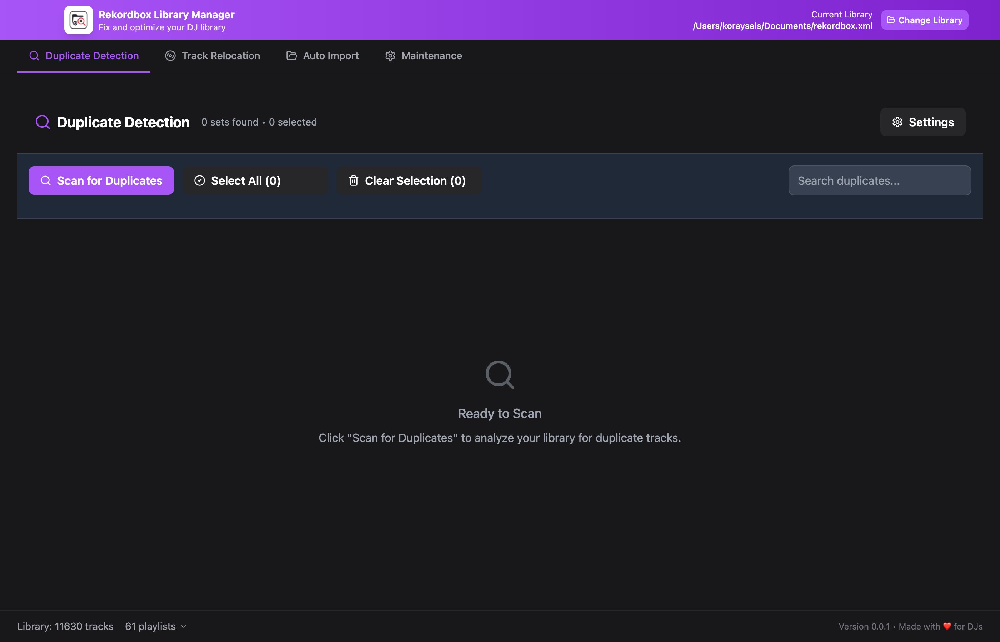
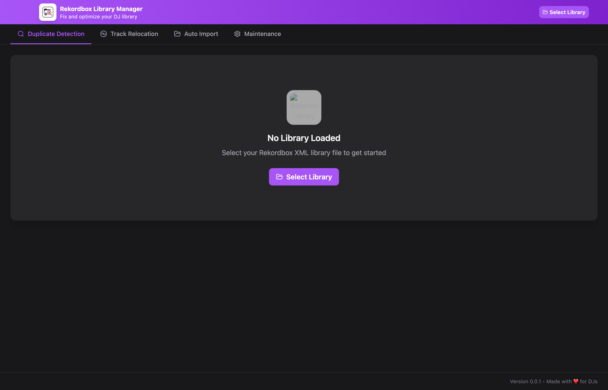

# 🎧 Rekordbox Library Manager

<div align="center">


**🚀 The ultimate open-source solution for DJs struggling with Rekordbox library management**

*Clean up duplicates, relocate missing tracks, and maintain your music collection like a pro*

[Download Latest Release](https://github.com/koraysels/rekordbox-library-manager/releases) • [Report Bug](https://github.com/koraysels/rekordbox-library-manager/issues) • [Request Feature](https://github.com/koraysels/rekordbox-library-manager/issues)

</div>

## 🎯 Why This Tool?

Every DJ knows the struggle: **duplicate tracks cluttering your library**, **missing files breaking your sets**, and **hours spent manually cleaning up your music collection**. This open-source tool was built by DJs, for DJs, to solve these exact problems.

### 😤 The Problems We Solve:
- 🎵 **Duplicate Nightmare**: Same track imported multiple times with different names
- 📁 **Missing Files**: Tracks showing as "!" in Rekordbox after moving music folders  
- ⏰ **Time Wasted**: Hours spent manually finding and fixing library issues
- 💸 **Expensive Software**: Commercial solutions that cost hundreds of dollars
- 🔒 **Limited Control**: Can't customize duplicate detection to your needs

### ✨ Our Solution:
A **free, open-source, professional-grade** library management tool that gives you complete control over your music collection.

---

## 🌟 Features

### 🔍 **Advanced Duplicate Detection**
- **🎵 Audio Fingerprinting**: Detects identical tracks even with different names
- **📝 Smart Metadata Matching**: Configurable field comparison (artist, title, album, BPM, key)
- **🎯 Confidence Scoring**: Know exactly how similar your tracks are
- **🎛️ Custom Rules**: Set your own detection sensitivity and field preferences

### 📍 **Intelligent Track Relocation** *(NEW!)*
- **🔎 Smart Search**: Automatically find relocated music files  
- **🎯 Similarity Matching**: Match tracks by metadata even when filenames change
- **📁 Bulk Operations**: Relocate hundreds of tracks with one click
- **⚡ Lightning Fast**: Advanced algorithms scan thousands of files in seconds

### 🛠️ **Professional Resolution Tools**
- **🏆 Quality-Based**: Keep highest bitrate/best quality versions automatically
- **📅 Date-Based**: Keep newest or oldest files based on your preference  
- **📂 Path Preferences**: Prioritize tracks from specific folders (e.g., "FLAC" over "MP3")
- **✋ Manual Control**: Review and choose exactly which tracks to keep

### 💾 **Smart Persistence** *(NEW!)*
- **🔄 Resume Sessions**: Your progress is automatically saved
- **📊 SQLite Backend**: Reliable database storage for large libraries
- **⚡ Instant Loading**: Return to exactly where you left off
- **🎯 Library-Specific**: Separate results for each Rekordbox library

---

## 📱 Screenshots

### 🏠 **Main Dashboard**
*Clean, modern interface built for DJs*



### 🔍 **Duplicate Detection**
*Find and resolve duplicates with professional precision*



### 📍 **Track Relocation**
*Automatically find and relocate missing tracks*


### ⚙️ **Advanced Settings**
*Complete control over detection algorithms*


---

## 🚀 Quick Start

### 📥 **Download & Install**

#### Option 1: Download Pre-built App *(Recommended)*
1. Go to [Releases](https://github.com/koraysels/rekordbox-library-manager/releases)
2. Download the latest version for your platform:
   - **Windows**: `Rekordbox-Library-Manager-Setup-0.0.2-alpha.exe`
   - **macOS**: `Rekordbox-Library-Manager-0.0.2-alpha.dmg`
3. Install and launch the app
4. Load your Rekordbox XML file and start cleaning!

#### Option 2: Build from Source
```bash
# Clone the repository
git clone https://github.com/koraysels/rekordbox-library-manager.git
cd rekordbox-library-manager

# Install dependencies
npm install

# Launch development version
npm run dev
```

### 🎵 **Using the Tool**

#### 📤 **Step 1: Export Your Rekordbox Library**

Before using this tool, you need to export your Rekordbox collection as an XML file:

1. **Open Rekordbox** on your computer
2. **Navigate to File Menu**: 
   - Click **File** in the top menu bar
   - Select **Export Collection in xml format**
   
   
   
3. **Choose Export Location**:
   - A dialog box will appear
   - Choose where to save your XML file (Desktop is recommended for easy access)
   - Name your file (e.g., "my-library-backup.xml")
   - Click **Save**
   
4. **Wait for Export**:
   - Rekordbox will export your entire collection
   - This may take a few minutes for large libraries (10,000+ tracks)
   - You'll see a progress indicator

> **💡 Pro Tip**: Export your library regularly as a backup! This XML file contains all your playlists, cue points, and track metadata.

#### 📁 **Step 2: Load Your Library**

1. **Launch Rekordbox Library Manager**
2. **Click "Load Library"** in the main interface  
3. **Select your XML file** from where you saved it
4. **Wait for parsing** - the tool will analyze your library structure

#### 🔍 **Step 3: Find Duplicates**

1. **Go to "Duplicate Detection" tab**
2. **Configure your detection settings** (optional):
   - Choose between Audio Fingerprinting and/or Metadata Matching
   - Select which metadata fields to compare
   - Set path preferences if you have organized folders
3. **Click "Scan for Duplicates"**
4. **Review the results** - duplicates will be grouped by similarity

#### 🛠️ **Step 4: Resolve Duplicates**

1. **Review found duplicates** - each group shows similar tracks
2. **Select which duplicates to resolve** (or use "Select All")
3. **Choose resolution strategy**:
   - **Keep Highest Quality**: Automatically keeps best bitrate/quality
   - **Keep Newest**: Keeps most recently modified files
   - **Keep Preferred Path**: Prioritizes tracks from specific folders
   - **Manual**: Review each duplicate individually
4. **Click "Resolve Selected"** 
5. **Confirm the operation** - a backup will be created automatically

#### 📍 **Step 5: Relocate Missing Tracks** *(Optional)*

If you have tracks showing as "!" (missing) in Rekordbox:

1. **Go to "Track Relocator" tab**
2. **Add search directories** where your music might be located
3. **Configure search settings** (depth, file types, similarity threshold)
4. **Click "Scan for Missing Tracks"**
5. **Review relocation candidates** 
6. **Apply relocations** for the matches you want to fix

---

## 🎛️ Advanced Configuration

### 🔍 **Duplicate Detection Settings**

```typescript
// Example configuration for different DJ styles
{
  // For Electronic Music DJs
  useFingerprint: true,        // Detect identical files
  useMetadata: true,          // Also check metadata
  metadataFields: ['artist', 'title', 'bpm', 'key'],
  
  // For Hip-Hop DJs  
  metadataFields: ['artist', 'title', 'album', 'duration'],
  pathPreferences: ['/FLAC/', '/WAV/', '/MP3/']
}
```

### 📍 **Track Relocation Options**

```typescript
{
  searchDepth: 3,             // How deep to search subdirectories
  matchThreshold: 0.8,        // 80% similarity required
  fileExtensions: ['.mp3', '.wav', '.flac', '.m4a'],
  includeSubdirectories: true
}
```

---

## 🛠️ **For Developers**

### 🏗️ **Tech Stack**
- **Frontend**: React 18 + TypeScript + Tailwind CSS
- **Backend**: Electron + Node.js
- **Database**: SQLite (better-sqlite3)  
- **Testing**: Vitest + Playwright
- **Build**: Vite + electron-builder

### 🧪 **Development Commands**
```bash
# Development
npm run dev              # Launch app with hot reload
npm run test:unit        # Run unit tests
npm run test:e2e         # Run end-to-end tests

# Building
npm run build            # Build for production
npm run dist:mac         # Create macOS installer
npm run dist:win         # Create Windows installer
npm run dist:all         # Build for all platforms
```

### 🏛️ **Architecture**
```
src/
├── main/           # Electron main process
├── renderer/       # React frontend
├── shared/         # Shared types & utilities
└── tests/          # Test suites
```

---

## 🤝 **Contributing**

We welcome contributions from the DJ community! Whether you're a developer or just a DJ with ideas:

### 🎵 **For DJs**:
- 🐛 [Report bugs](https://github.com/koraysels/rekordbox-library-manager/issues) you encounter
- 💡 [Suggest features](https://github.com/koraysels/rekordbox-library-manager/issues) you'd love to see
- 📝 Share your workflow and use cases
- ⭐ Star the repo to help other DJs find it

### 👨‍💻 **For Developers**:
1. Fork the repository
2. Create a feature branch (`git checkout -b feature/amazing-feature`)
3. Follow the [development setup](#-for-developers)
4. Write tests for your changes
5. Submit a pull request

### 🎯 **Priority Features We Need Help With**:
- [ ] **Serato/VirtualDJ support**: Expand beyond Rekordbox
- [ ] **Playlist duplicate detection**: Find duplicates across playlists
- [ ] **Audio analysis**: BPM/key detection for better matching
- [ ] **Batch processing**: Handle multiple libraries
- [ ] **Cloud backup**: Sync settings across devices
- [ ] **Plugin system**: Custom duplicate detection algorithms

---

## 🙋‍♂️ **FAQ**

### ❓ **Is this safe to use with my library?**
**Yes!** The tool creates backups before making any changes. Your original files are never modified directly.

### ❓ **Does this work with large libraries?**
**Absolutely!** Tested with libraries containing 50,000+ tracks. Uses SQLite for performance and persistent storage.

### ❓ **Can I undo changes?**
**Yes!** Every operation creates a backup XML file. You can always restore your library to its previous state.

### ❓ **What about other DJ software?**
Currently supports Rekordbox XML format. Serato and VirtualDJ support is planned for future releases.

### ❓ **Is this really free?**
**100% free and open source!** No ads, no subscriptions, no limits. MIT licensed.

---

## 🛣️ **Roadmap**

### 📅 **v0.0.3** *(Next Release)*
- [ ] **Playlist Management**: Duplicate detection within playlists
- [ ] **Better UI**: Improved design and user experience
- [ ] **Performance**: Even faster scanning for large libraries
- [ ] **Auto-updater**: Stay updated automatically

### 📅 **v0.1.0** *(Major Release)*
- [ ] **Multi-format Support**: Serato, VirtualDJ, Traktor
- [ ] **Audio Analysis**: Automatic BPM/key detection
- [ ] **Cloud Sync**: Backup settings and preferences
- [ ] **Plugin System**: Custom detection algorithms

### 📅 **v1.0.0** *(Full Release)*
- [ ] **Professional Features**: Advanced audio analysis
- [ ] **Enterprise Tools**: Batch processing, API access
- [ ] **Community Features**: Share detection rules, presets

---

## 🎉 **Success Stories**

> *"Cleaned up 2,500 duplicates in my 15,000 track library in under 10 minutes. This tool is a lifesaver!"*
> — DJ MaxTech

> *"Finally found all my missing tracks after moving my music drive. Saved me literally hours of work."*
> — Sarah K., Wedding DJ

> *"The audio fingerprinting is incredible - it found duplicates I didn't even know existed."*
> — Mike R., Club DJ

---

## 🆘 **Support & Community**

### 💬 **Get Help**:
- 📖 [Check the Documentation](CLAUDE.md)
- 🐛 [Report Issues](https://github.com/koraysels/rekordbox-library-manager/issues)
- 💡 [Request Features](https://github.com/koraysels/rekordbox-library-manager/discussions)

### 🌟 **Show Support**:
- ⭐ **Star this repository** to help other DJs find it
- 🐦 **Share on social media** with your DJ friends
- 💝 **Contribute code** or documentation improvements
- 🎵 **Tell other DJs** about this tool

---

## 📜 **License**

This project is licensed under the **MIT License** - see the [LICENSE](LICENSE) file for details.

**What this means for you:**
- ✅ Use it commercially
- ✅ Modify the source code  
- ✅ Distribute copies
- ✅ Use it privately
- ✅ No attribution required (but appreciated!)

---

## 🙏 **Acknowledgments**

- **Pioneer DJ** for creating Rekordbox and the XML export format
- **The open-source community** for the incredible libraries that make this possible
- **Beta testers** from the DJ community who helped refine this tool
- **All DJs** who struggle with library management - this one's for you! 🎵

---

<div align="center">

**Made with ❤️ by DJs, for DJs**

*If this tool saved you time, consider [starring the repo](https://github.com/koraysels/rekordbox-library-manager) to help other DJs discover it!*

[⬆️ Back to Top](#-rekordbox-library-manager)

</div>