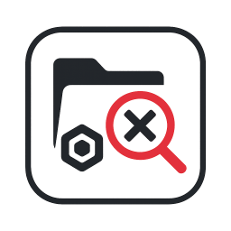
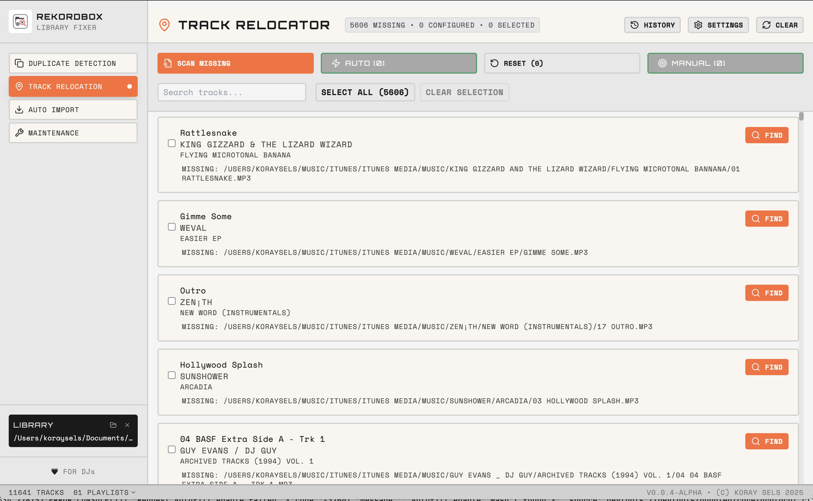
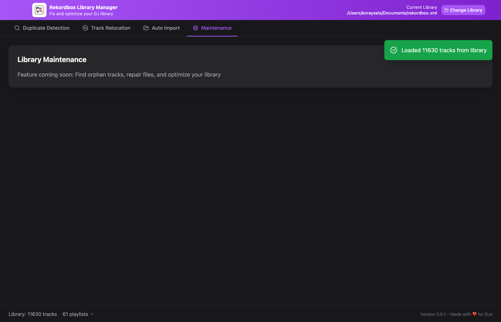
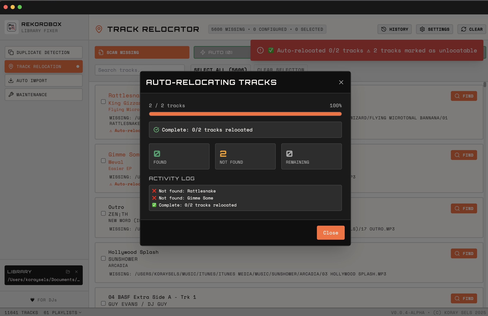
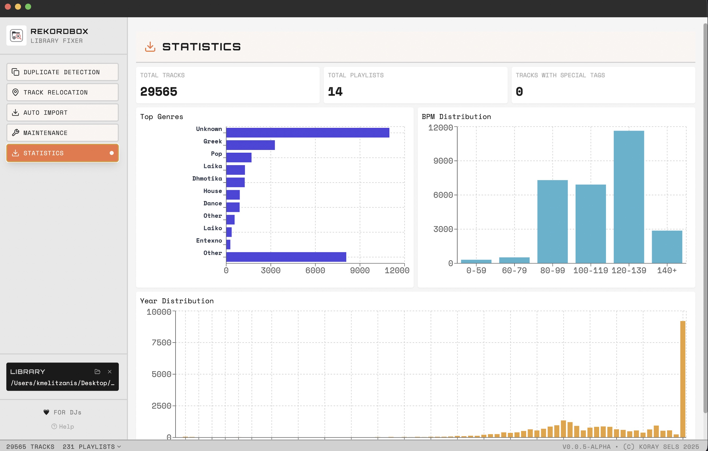
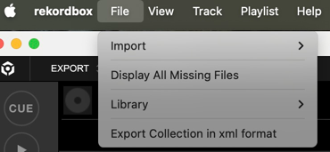
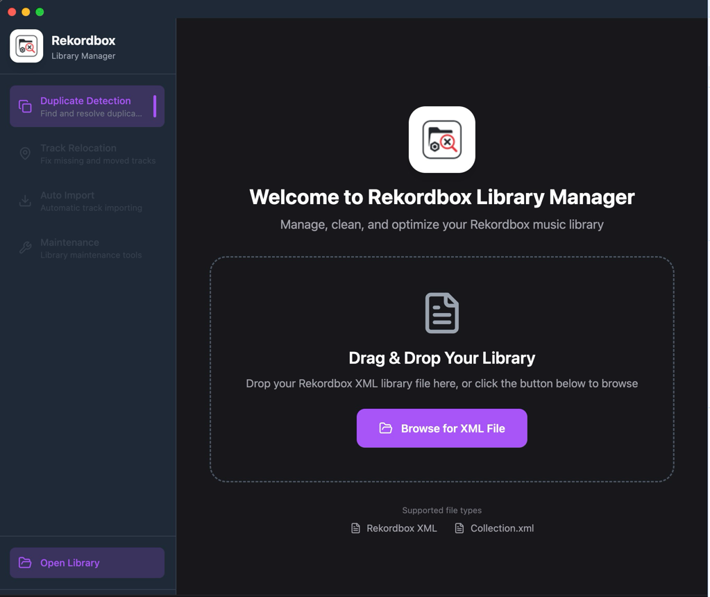
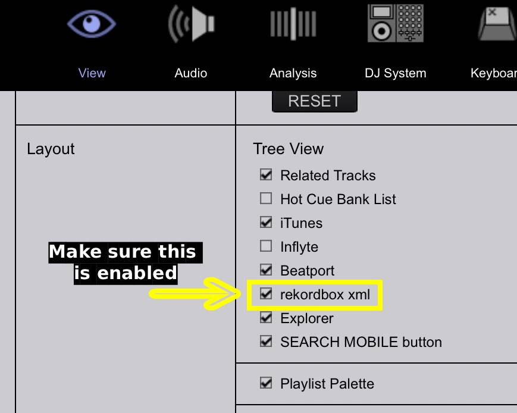
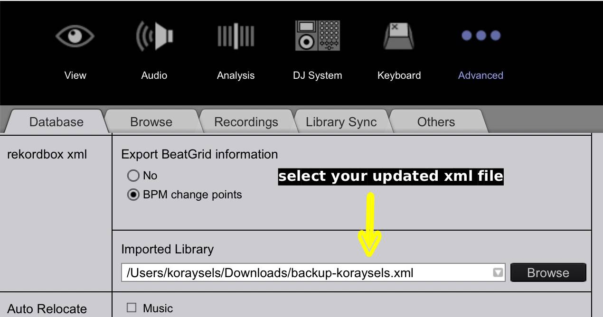
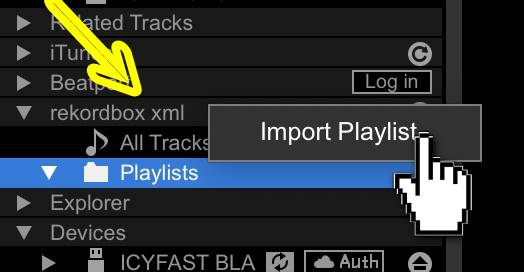

# Rekordbox Library Fixer

<div align="center">




**Just trying to make DJs' lives a bit easier, one library at a time**

*Find duplicates, fix missing tracks, and keep your DJ metadata intact*

[Download Latest Release](https://github.com/koraysels/rekordbox-library-fixer/releases) • [Report Bug](https://github.com/koraysels/rekordbox-library-fixer/issues)

</div>

---

## Table of Contents

- [Why This Exists](#why-this-exists)
- [What It Does](#what-it-does)
- [Screenshots](#screenshots)
- [Quick Start](#quick-start)
  - [Download & Install](#download--install)
  - [Using the Tool](#using-the-tool)
- [For Developers](#for-developers)
- [Contributing](#contributing)
- [FAQ](#faq)
- [Roadmap](#roadmap)
- [Support](#support)
- [License](#license)

---

## Why This Exists

You're prepping for a gig and realize you have 47 versions of "One More Time" and half your tracks show as "!" because you reorganized your music folder. This tool handles those two problems: duplicate detection and track relocation.

I'm aware of commercial tools like Rekordbox Collection Tool (RCT) by MixMasterG, but it's macOS-only and closed source. This is free and cross-platform.

**The common pain points:**
- Duplicate tracks with slightly different names cluttering your library
- Missing file references ("!" tracks) after moving your music folder
- Spending more time organizing than mixing

---

## What It Does

### Two ways to load your library
- **XML export** — the classic route: export from Rekordbox, load the file
- **Rekordbox's own database** — read `master.db` directly, no export needed. It is encrypted, so paste its key once on the load screen. Reading happens on a copy (including its WAL), so Rekordbox can stay open while you look around.

Resolving duplicates writes back into `master.db` itself, because a Rekordbox XML import can only add and update tracks — it can never remove one. That is why an XML round-trip leaves every duplicate in place. Writing is deliberately hedged: Rekordbox must be closed, a backup is taken first and is mandatory, playlist links are re-pointed at the kept entry before anything is removed, and Rekordbox's own update counter is bumped so it notices the change on next launch.

### Library tab
The first tab in the sidebar. With nothing loaded it holds the picker, including the libraries found on your system. With a library open it shows what is loaded — file name, full path, track count, playlists, missing files and duplicate entries — and lets you close it or switch to another one. Backups and History stay reachable at all times, even with no library loaded.

### Duplicate Detection
- **Audio fingerprinting**: Finds identical tracks even with different filenames
- **Metadata matching**: Compares artist, title, BPM, key — configurable
- **Confidence scoring**: Shows how certain the match is
- **Flexible settings**: Adjust thresholds to suit your library

### Track Relocation
- **Smart search**: Automatically finds moved music files
- **Similarity matching**: Matches tracks even when filenames differ
- **Bulk operations**: Fix hundreds of missing tracks at once
- **Unlocatable tracking**: Marks tracks that couldn't be auto-relocated for manual review
- **Damaged paths**: when the stored path is unusable (a folder, a truncated path), the search falls back to the track title instead of giving up

### Resolution Options
- **Quality-based**: Keeps the highest bitrate version; optionally prefer lossless formats (FLAC, WAV, AIFF) over lossy regardless of bitrate
- **Date-based**: Keep newest or oldest files
- **Folder preferences**: Prioritize tracks from certain directories
- **Manual mode**: Review everything yourself

### Lossless-aware quality scoring
When "Keep Highest Quality" is selected, you can enable **Prefer lossless formats** in settings. When on, FLAC/WAV/AIFF always wins over MP3/AAC/OGG regardless of bitrate — fixing the case where Rekordbox stores lossless files with `BitRate=0`. When off (default), quality is judged purely by bitrate and file size, which is safer for setups where players don't support FLAC.

Quality priority order when lossless preference is enabled:

| Factor | Notes |
|--------|-------|
| Lossless tier | FLAC, WAV, AIFF always beats MP3, AAC, OGG |
| Bitrate | Higher wins within the same tier |
| Sample rate | 96kHz beats 44.1kHz for ties between lossless files |
| File size | Larger as final fallback |
| Metadata richness | BPM, key, cues, loops, beatgrid bonuses |

### In-app Track Preview
- **Play, pause, seek, volume** — audition tracks without leaving the app
- **Play button on every track row**: duplicates, missing/relocate, track details
- **Persistent mini-player** bar that survives page switches
- **AIFF supported** (rewrapped to WAV on the fly — Chromium can't play AIFF natively); mp3/m4a/flac/wav/ogg play directly
- Volume is remembered across sessions; space bar toggles play/pause

### Activity History
- Every library-changing operation is recorded: duplicate merges and relocations
- Expand an entry to see exactly which tracks were merged, which files went to the trash, and what failed
- Backup path for each operation, revealable in Finder/Explorer

### Duplicate files vs duplicate entries
Two different situations wear the word "duplicate", and the difference decides whether a file leaves your disk. Every set states the real numbers, for example `4 entries · 2 files`, and each entry says what will happen to it:
- **Extra listing · no file removed** — points at the same file as the entry being kept. Rekordbox simply listed it twice; only the duplicate listing goes.
- **Own file · trashed if enabled** — a second copy in another folder. The only kind that frees disk space, and only when you tick the trash option.

Resolving **merges** the other entries into the kept one: every playlist that referenced any of them now points at the kept entry, so no playlist loses the song. Files move to the system trash, never straight to deletion, and a file the kept entry still uses is never touched. A filter narrows the list to one kind, and Select All follows it. An in-app help section explains all of this next to the results.

### Streaming tracks
Tracks from TIDAL, Spotify, Beatport, SoundCloud and Apple Music have no file on your disk by design. They used to look like damage. They are now labelled with their service, kept out of the broken-entry list, and can be filtered in or out so they never end up in a cleanup by accident.

### When the files are gone
If a duplicate set's files can't be read, the app says so instead of inventing certainty. It falls back to matching on artist, title and length, reports the match as **metadata** rather than a fingerprint, and the badge reads `2 entries · files missing` instead of claiming a file count. Such a set is still worth resolving: it collapses two missing tracks into one, which is one relocation instead of two.

### Broken entries
Finds library entries whose path is damaged rather than merely moved — a path pointing at a folder, a truncated path, an empty location. Streaming tracks and ordinary missing files are excluded, because those belong to relocation, not to cleanup.

### Backups
A backup manager reachable at any time, with or without a library loaded. Lists every backup the app has taken, restores one (writing a safety copy of the current state first), and asks whether you want to load the restored library straight away.

### Notifications
Toasts stack instead of replacing each other, stay long enough to read, and can be dismissed. Important results — a finished scan, a completed resolve, a failure — also raise a system notification, so a long scan can run while you do something else.

### Statistics
- Genre distribution (top 10 with track list on hover)
- BPM distribution by range
- Year distribution

### Session Persistence
- Picks up where you left off if you close the app
- Uses IndexedDB (no external database needed)
- Results are stored per-library

---

## Screenshots

### Main Dashboard



### Duplicate Detection



### Track Relocation



### Statistics



### Settings


---

## Quick Start

### Download & Install

#### Option 1: Pre-built App (Recommended)

1. Go to [Releases](https://github.com/koraysels/rekordbox-library-fixer/releases)
2. Download the right file for your system:

**Windows:**
- `Rekordbox.Library.Fixer.Setup.x.x.x-alpha.exe` — installer (recommended)
- `Rekordbox.Library.Fixer-x.x.x-alpha-win.zip` — portable

**macOS:**
- `Rekordbox.Library.Fixer-x.x.x-arm64.dmg` — Apple Silicon (M1/M2/M3/M4)
- `Rekordbox.Library.Fixer-x.x.x.dmg` — Intel (pre-2020 Macs)

> **Not sure which Mac you have?** Click the Apple menu > About This Mac. If it says "Intel" under Processor/Chip, use the Intel DMG. If it says "Apple M1/M2/M3/M4", use the arm64 one.

**Linux:**
- `rekordbox-library-manager-x.x.x-alpha.AppImage` — universal AppImage
- `rekordbox-library-manager_x.x.x-alpha_arm64.deb` — Debian/Ubuntu

3. Install and launch

#### macOS: Opening an Unsigned App

Since this app isn't signed with an Apple Developer certificate, macOS may warn you about it. The `xattr` command in Terminal removes the quarantine flag:

```bash
xattr -dr com.apple.quarantine /Applications/Rekordbox\ Library\ Fixer.app
```

Alternatively, right-click the app and choose **Open**, then click **Open** in the dialog that appears.

#### Option 2: Build from Source

```bash
git clone https://github.com/koraysels/rekordbox-library-fixer.git
cd rekordbox-library-fixer
npm install
npm run dev
```

---

### Using the Tool

#### Step 1: Export Your Rekordbox Library

1. Open Rekordbox
2. Go to **File → Export Collection in xml format**

   

3. Save the XML file somewhere easy to find (e.g. Desktop)
4. Large libraries (10,000+ tracks) may take a few minutes to export

> **Tip**: Export your library regularly as a backup — the XML contains all your playlists, cue points, and track metadata.

#### Step 2: Load Your Library

**Drag & Drop:**
1. Launch Rekordbox Library Fixer
2. Drag your XML file onto the app window



**Browse:**
1. Launch the app
2. Click **Browse for XML File** and select your file

#### Step 3: Find Duplicates

1. Go to the **Duplicate Detection** tab
2. Configure detection settings (optional): audio fingerprinting, metadata fields, path preferences
3. Click **Scan for Duplicates**
4. Review the grouped results

#### Step 4: Resolve Duplicates

1. Review the duplicate groups
2. Select duplicates to resolve (or **Select All**)
3. Choose a resolution strategy:
   - **Keep Highest Quality** — keeps best bitrate
   - **Keep Newest** — most recently modified
   - **Keep Preferred Path** — prioritizes specific folders
   - **Manual** — review each pair yourself
4. Click **Resolve Selected** and confirm

#### Step 5: Relocate Missing Tracks (Optional)

If tracks show as "!" in Rekordbox:

1. Go to the **Track Relocator** tab
2. Add search directories where your music might be
3. Configure search depth and similarity threshold
4. Click **Scan for Missing Tracks**
5. Review candidates and apply the relocations you want

#### Step 6: Import Back to Rekordbox

**Enable XML import in Rekordbox:**

1. Open Rekordbox
2. Go to view preferences and enable **"rekordbox xml"** in the Tree View



**Import the cleaned file:**

1. Navigate to the **Database** tab
2. Select your updated XML file (saved with `_cleaned` suffix by the tool)



3. Keep **BPM change points** checked to preserve beatgrid data
4. Click **Import** and wait for processing

**Import playlists:**

1. In the left sidebar, find the **rekordbox xml** section
2. Right-click **Playlists** and select **Import Playlist**



**Verify:**
- Check playlist track counts are correct
- Confirm duplicates are removed
- Test that relocated tracks play

> **Backup reminder**: Before importing, back up your Rekordbox database:
> - Windows: `%APPDATA%\Pioneer\rekordbox`
> - macOS: `~/Library/Pioneer/rekordbox`

---

## For Developers

### Tech Stack
- **Frontend**: React 18 + TypeScript + Tailwind CSS
- **Backend**: Electron + Node.js
- **Storage**: Dexie.js (IndexedDB)
- **State**: Zustand with persistence
- **Testing**: Vitest + Playwright
- **Build**: Vite + electron-builder

### Development Commands
```bash
# Development
npm run dev              # Launch with hot reload
npm run test:unit        # Unit tests
npm run test:e2e         # End-to-end tests

# Building
npm run build            # Production build
npm run dist:mac         # macOS installer
npm run dist:win         # Windows installer
npm run dist:all         # All platforms
```

### Architecture
```
src/
├── main/           # Electron main process
├── renderer/       # React frontend
├── shared/         # Shared types and utilities
└── tests/          # Test suites
```

---

## Contributing

### For DJs:
- [Report bugs](https://github.com/koraysels/rekordbox-library-fixer/issues)
- [Suggest features](https://github.com/koraysels/rekordbox-library-fixer/issues)
- Share your workflow and use cases
- Star the repo to help other DJs find it

### For Developers:
1. Fork the repository
2. Create a feature branch (`git checkout -b feature/my-feature`)
3. Write tests for your changes
4. Submit a pull request

### Areas needing help:
- FLAC conversion pipeline for CDJ compatibility
- Performance profiling on very large libraries (50k+ tracks)
- Windows / Linux testing and bug reports

---

## FAQ

**Is this safe to use with my library?**
A backup is taken before any change, and it is mandatory — writing is refused if one cannot be made. Files go to the system trash rather than being deleted, and a file the kept track still uses is never touched. Writing to `master.db` additionally requires Rekordbox to be closed.

**Why does resolving duplicates need to write to master.db?**
Because a Rekordbox XML import can add and update tracks but cannot remove one. Importing a cleaned XML leaves every duplicate sitting in your collection. Changing the database is the only way to actually clean it.

**Does it work with large libraries?**
Yes. Tested with libraries containing 50,000+ tracks. Uses IndexedDB (via Dexie.js) for performance and persistent storage.

**Can I undo changes?**
Yes. Every operation creates a backup XML file you can restore from.

**What about other DJ software?**
Currently supports Rekordbox XML format. Serato and VirtualDJ may be added if there's enough interest.

**Is it free?**
Free for personal use. No ads, no subscriptions, no limits.

---

## Roadmap

**v0.6.1** *(current)*
- Library tab holding the picker, the statistics of what is loaded, and unload/switch
- Streaming tracks (TIDAL, Spotify, Beatport, SoundCloud, Apple Music) labelled and filterable, never treated as damage
- Relocation falls back to the track title when the stored path is damaged
- Notifications stack, persist and can be dismissed; important events also raise a system notification
- Honest reporting when files are missing: metadata match instead of a claimed fingerprint, and no invented file count

**v0.6.0**
- Duplicate resolving writes into `master.db` itself, so the collection is really cleaned — Rekordbox must be closed and a backup is mandatory
- Backup manager reachable at any time, with an offer to load a library straight after restoring it
- Broken entries: damaged paths found and separated from tracks that are merely missing

**v0.5.0**
- Read the library straight from Rekordbox's `master.db`, no XML export needed
- Duplicate sets state how many entries and how many real files they involve, with in-app help
- Never writes over the database, and paths differing only in Unicode form are recognised as one file

**v0.4.0**
- History tab: an audit trail of everything the app changed, with per-item detail
- Duplicate files and duplicate Rekordbox entries are told apart and can be cleaned up separately
- Faster tab navigation, and settings that stay put

**v0.3.0**
- Duplicate scan: live progress, results stream in as they're found, and the scan can be cancelled without losing what it found
- Duplicate resolution keeps playlists intact — removed copies are re-pointed at the kept track instead of dropped
- Files are moved to the system trash instead of being deleted permanently, and a file a kept track still uses is never touched
- In-app track preview — play/pause/seek/volume from any track row, with AIFF support
- Relocator: handles libraries with thousands of missing tracks without crashing; safe cancellation; search settings now persist

**Next — relocation into master.db**
- Relocation currently rewrites an XML library; writing the new paths into `master.db` is the remaining gap

**FLAC conversion**
- Convert FLAC files to WAV or AIFF for compatibility with older CDJs (CDJ-2000NXS and earlier) that don't support FLAC playback
- Batch conversion with original file preservation
- Automatic library location update after conversion

---

## Support

- [Report Issues](https://github.com/koraysels/rekordbox-library-fixer/issues)
- [Ko-fi](https://ko-fi.com/koraysels) — if this saved you time

---

## License

Custom non-commercial license — see [LICENSE](LICENSE) for details.

- Free for personal use
- Study and contribute to the code
- Internal business use is fine
- No commercial repackaging or selling

---

<div align="center">

**Made by a DJ who got tired of messy libraries**

[Back to Top](#rekordbox-library-fixer)

</div>
