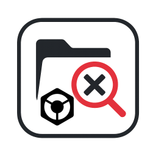

# 🎧 Rekordbox Library Manager

<div align="center">




**🤞 Just trying to make DJs' lives a bit easier, one library at a time**

*Maybe this will help you clean up those pesky duplicates and find your missing tracks*

[Download Latest Release](https://github.com/koraysels/rekordbox-library-fixer/releases) • [Report Bug](https://github.com/koraysels/rekordbox-library-fixer/issues) • [Request Feature](https://github.com/koraysels/rekordbox-library-fixer/issues)

</div>

## 🎯 Why We Made This

Look, we've all been there. You're prepping for a gig and suddenly realize you have 47 versions of "One More Time" and half your tracks show up as "!" because you moved your music folder again. Frustrating, right?

This little tool is just our attempt to help fellow DJs deal with the chaos. Will it solve all your problems? Probably not. But hopefully it'll save you some time and headaches.
I am aware of other (commercial) tools available, like the excellent Rekordbox Collection Tool (RCT) by MixMasterG, but is Mac only and not open-source. 

### 😤 The Stuff That's Annoying:
- 🎵 **Too Many Duplicates**: Same track, but with slightly different names, cluttering everything
- 📠**Missing Files**: You know, those dreaded "!" tracks that mess up your flow    
- ⏰ **Time Sink**: Spending more time organizing music than actually mixing it
- 💸 **Expensive Tools**: Why pay hundreds when it should just... work?
- 🔒 **No Control**: Can't tweak things the way *you* want them

### ✨ What We're Trying to Do:
Make a simple, free tool that might help you get your library back under control. No promises, but it's worked for us and hopefully will for you too! 🤞

---

## 🌟 What It Does

### 🔍 **Duplicate Detection** 
- **🎵 Audio Fingerprinting**: Finds identical tracks even when they have different names (pretty cool, right?)
- **📝 Metadata Matching**: Compares artist, title, BPM, key - whatever fields you want
- **🎯 Confidence Scoring**: Shows how sure we are that tracks are actually duplicates
- **🎛️ Your Rules**: Tweak the settings however you like - it's your library!

### 📍 **Track Relocation** *(NEW!)*
- **🔎 Smart Search**: Tries to find your moved music files automatically  
- **🎯 Similarity Matching**: Matches tracks even when filenames are different
- **📁 Bulk Operations**: Fix hundreds of tracks at once (if you're lucky!)
- **⚡ Fast Enough**: Scans through lots of files without making you wait forever
- **⚠️ Unlocatable Tracking**: Marks tracks that couldn't be auto-relocated so you can retry or handle them manually

### 🛠️ **Resolution Options**
- **🏆 Quality-Based**: Keeps the highest bitrate versions (usually what you want)
- **📅 Date-Based**: Keep the newest or oldest files - your choice  
- **📂 Folder Preferences**: Prioritize tracks from certain folders (like keeping FLAC over MP3)
- **✋ Manual Mode**: Check everything yourself if you're the careful type

### 💾 **Remembers Your Stuff** *(NEW!)*
- **🔄 Picks Up Where You Left Off**: No need to start over if you close the app
- **📊 IndexedDB Storage**: Built-in browser storage - no external database needed!
- **⚡ Quick Loading**: Opens right back to where you were
- **🎯 Per-Library**: Keeps results separate for each of your Rekordbox libraries

---

## 📱 Screenshots

### 🏠 **Main Dashboard**
*The main screen - nothing fancy, just gets the job done*


### 🔍 **Duplicate Detection**
*This is where the magic happens (hopefully)*


### 📍 **Track Relocation**
*For when your tracks decide to play hide and seek*


### ⚙️ **Settings**
*Tweak things until they work the way you want*


---

## 🚀 Quick Start

### 📥 **Download & Install**

#### Option 1: Download Pre-built App *(Recommended)*
1. Go to [Releases](https://github.com/koraysels/rekordbox-library-manager/releases)
2. Download the latest version for your platform:
   - **Windows**: `Rekordbox-Library-Manager-Setup-0.0.3-alpha.exe`
   - **macOS**: `Rekordbox-Library-Manager-0.0.3-alpha.dmg`
3. Install and launch the app
4. Export you collection as xml using Rekordbox.  
  
5. Load your Rekordbox XML file and start cleaning!  


#### Option 2: Build from Source
```bash
# Clone the repository
git clone https://github.com/koraysels/rekordbox-library-manager.git
cd rekordbox-library-manager

# Install dependencies
npm install

# Launch development version
npm run dev
```

### 🎵 **Using the Tool**

#### 📤 **Step 1: Export Your Rekordbox Library**

Before using this tool, you need to export your Rekordbox collection as an XML file:

1. **Open Rekordbox** on your computer
2. **Navigate to File Menu**: 
   - Click **File** in the top menu bar
   - Select **Export Collection in xml format**
   
   
   
3. **Choose Export Location**:
   - A dialog box will appear
   - Choose where to save your XML file (Desktop is recommended for easy access)
   - Name your file (e.g., "my-library-backup.xml")
   - Click **Save**
   
4. **Wait for Export**:
   - Rekordbox will export your entire collection
   - This may take a few minutes for large libraries (10,000+ tracks)
   - You'll see a progress indicator

> **💡 Pro Tip**: Export your library regularly as a backup! This XML file contains all your playlists, cue points, and track metadata.

#### 📁 **Step 2: Load Your Library**

You can load your library in two convenient ways:

**Option A: Drag & Drop** *(Easy & Fast)*
1. **Launch Rekordbox Library Manager**
2. **Simply drag your XML file** directly onto the application window
3. **Drop it anywhere** on the interface - the app will automatically detect and load it
4. **Wait for parsing** - the tool will analyze your library structure


**Option B: Browse for File** *(Traditional)*
1. **Launch Rekordbox Library Manager**
2. **Click "Browse for XML File"** in the main interface  
3. **Select your XML file** from where you saved it
4. **Wait for parsing** - the tool will analyze your library structure

#### 🔍 **Step 3: Find Duplicates**

1. **Go to "Duplicate Detection" tab**
2. **Configure your detection settings** (optional):
   - Choose between Audio Fingerprinting and/or Metadata Matching
   - Select which metadata fields to compare
   - Set path preferences if you have organized folders
3. **Click "Scan for Duplicates"**
4. **Review the results** - duplicates will be grouped by similarity

#### 🛠️ **Step 4: Resolve Duplicates**

1. **Review found duplicates** - each group shows similar tracks
2. **Select which duplicates to resolve** (or use "Select All")
3. **Choose resolution strategy**:
   - **Keep Highest Quality**: Automatically keeps best bitrate/quality
   - **Keep Newest**: Keeps most recently modified files
   - **Keep Preferred Path**: Prioritizes tracks from specific folders
   - **Manual**: Review each duplicate individually
4. **Click "Resolve Selected"** 
5. **Confirm the operation** - a backup will be created automatically

#### 📍 **Step 5: Relocate Missing Tracks** *(Optional)*

If you have tracks showing as "!" (missing) in Rekordbox:

1. **Go to "Track Relocator" tab**
2. **Add search directories** where your music might be located
3. **Configure search settings** (depth, file types, similarity threshold)
4. **Click "Scan for Missing Tracks"**
5. **Review relocation candidates** 
6. **Apply relocations** for the matches you want to fix

#### 📥 **Step 6: Import Back to Rekordbox**

After cleaning your library, you'll want to import the updated XML back to Rekordbox:

1. **In Rekordbox**: Go to **File → Import → Collection** 
2. **Select the updated XML file** (the tool creates a new file with "_cleaned" suffix)
3. **Choose import options**:
   - ✅ **Replace current collection** (recommended for cleanest results)
   - ⚠️ **Merge with current collection** (if you want to keep existing data)
4. **Wait for import** - Rekordbox will process your cleaned library
5. **Verify results** - check that duplicates are gone and missing tracks are found

> **⚠️ Important**: Always backup your original Rekordbox library before importing! The tool creates backups automatically, but it's good practice to have your own copy.

---

## 🎛️ Advanced Configuration

### 🔍 **Duplicate Detection Settings**

```typescript
// Example configuration for different DJ styles
{
  // For Electronic Music DJs
  useFingerprint: true,        // Detect identical files
  useMetadata: true,          // Also check metadata
  metadataFields: ['artist', 'title', 'bpm', 'key'],
  
  // For Hip-Hop DJs  
  metadataFields: ['artist', 'title', 'album', 'duration'],
  pathPreferences: ['/FLAC/', '/WAV/', '/MP3/']
}
```

### 📍 **Track Relocation Options**

```typescript
{
  searchDepth: 3,             // How deep to search subdirectories
  matchThreshold: 0.8,        // 80% similarity required
  fileExtensions: ['.mp3', '.wav', '.flac', '.m4a'],
  includeSubdirectories: true
}
```

---

## 🛠️ **For Developers**

### 🏗️ **Tech Stack**
- **Frontend**: React 18 + TypeScript + Tailwind CSS
- **Backend**: Electron + Node.js
- **Storage**: Dexie.js (IndexedDB) - no external database needed!
- **State Management**: Zustand with persistence
- **Testing**: Vitest + Playwright
- **Build**: Vite + electron-builder

### 🧪 **Development Commands**
```bash
# Development
npm run dev              # Launch app with hot reload
npm run test:unit        # Run unit tests
npm run test:e2e         # Run end-to-end tests

# Building
npm run build            # Build for production
npm run dist:mac         # Create macOS installer
npm run dist:win         # Create Windows installer
npm run dist:all         # Build for all platforms
```

### 🏛️ **Architecture**
```
src/
├── main/           # Electron main process
├── renderer/       # React frontend
├── shared/         # Shared types & utilities
└── tests/          # Test suites
```

---

## 🤝 **Contributing**

We welcome contributions from the DJ community! Whether you're a developer or just a DJ with ideas:

### 🎵 **For DJs**:
- 🐛 [Report bugs](https://github.com/koraysels/rekordbox-library-manager/issues) you encounter
- 💡 [Suggest features](https://github.com/koraysels/rekordbox-library-manager/issues) you'd love to see
- 📝 Share your workflow and use cases
- ⭐ Star the repo to help other DJs find it

### 👨‍💻 **For Developers**:
1. Fork the repository
2. Create a feature branch (`git checkout -b feature/amazing-feature`)
3. Follow the [development setup](#-for-developers)
4. Write tests for your changes
5. Submit a pull request

### 🎯 ** Features we could use your help with**:
- [ ] **Serato/VirtualDJ support**: Expand beyond Rekordbox
- [ ] **Playlist duplicate detection**: Find duplicates in playlists
- [ ] **Audio analysis**: BPM/key detection for better matching
- [ ] **Batch processing**: Handle multiple libraries
- [ ] **Plugin system**: Custom duplicate detection algorithms

---

## 🙋‍♂️ **FAQ**

### ❓ **Is this safe to use with my library?**
**Yes!** The tool creates backups before making any changes. Your original files are never modified directly.

### ❓ **Does this work with large libraries?**
**Absolutely!** Tested with libraries containing 50,000+ tracks. Uses Indexdb (Dexie.js) for performance and persistent storage.

### ❓ **Can I undo changes?**
**Yes!** Every operation creates a backup XML file. You can always restore your library to its previous state.

### ❓ **What about other DJ software?**
Currently supports Rekordbox XML format. Serato and VirtualDJ might be supported in future versions if enough people want it.

### ❓ **Is this really free?**
**100% free for personal use!** No ads, no subscriptions, no limits. Open source but protected against commercial repackaging.

---

## 🛣️ **Roadmap**

### 📅 **v0.0.3** *(Next Release)*
- [ ] **Playlist Management**: Duplicate detection within playlists
- [ ] **Better UI**: Improved design and user experience
- [ ] **Performance**: Even faster scanning for large libraries
- [ ] **Auto-updater**: Stay updated automatically

### 📅 **v0.1.0** *(Major Release)*
- [ ] **Multi-format Support**: Serato, VirtualDJ, Traktor
- [ ] ***Maintenance Mode**
- [ ] ***Auto Import Mode*** import new tracks, preventing duplicates and replacing lower bitrate tracks with better quality ones. Update all playlists to include the new, higher quality audio file

### 📅 **v1.0.0** *(Full Release)*
- [ ] **Stability & Performance is fine-tuned**: 
---

## 🆘 **Support & Community**

### 💬 **Get Help**:
- 📖 [Check the Documentation](CLAUDE.md)
- 🐛 [Report Issues](https://github.com/koraysels/rekordbox-library-manager/issues)
- 💡 [Request Features](https://github.com/koraysels/rekordbox-library-manager/discussions)

### 🌟 **Show Support**:
- ⭐ **Star this repository** to help other DJs find it
- ☕ **[Buy me a coffee on Ko-fi](https://ko-fi.com/koraysels)** if this tool saved you time
- 🐦 **Share on social media** with your DJ friends
- 💝 **Contribute code** or documentation improvements
- 🎵 **Tell other DJs** about this tool

---

## 📜 **License**

This project is licensed under a **custom non-commercial license** - see the [LICENSE](LICENSE) file for details.

**What this means for you:**
- ✅ **Free personal use** - use it for your own music libraries
- ✅ **Study the code** - learn from it, contribute improvements  
- ✅ **Internal business use** - use it within your organization
- ✅ **Share with friends** - distribute freely for non-commercial use
- ❌ **No commercial repackaging** - can't sell it or offer as paid service
- ❌ **No proprietary versions** - modifications must stay open source

---

## 🙏 **Acknowledgments**

- **Pioneer DJ** for creating Rekordbox and the XML export format
- **The open-source community** for the incredible libraries that make this possible
- **Beta testers** from the DJ community who helped refine this tool
- **All DJs** who struggle with library management - this one's for you! 🎵

---

<div align="center">

**Made by a DJ who got tired of messy libraries**

*If this thing actually helped you, maybe give it a star so other DJs can find it? No pressure though! 😊*

[⬆️ Back to Top](#-rekordbox-library-manager)

</div>
